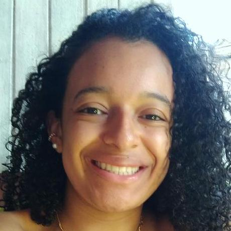
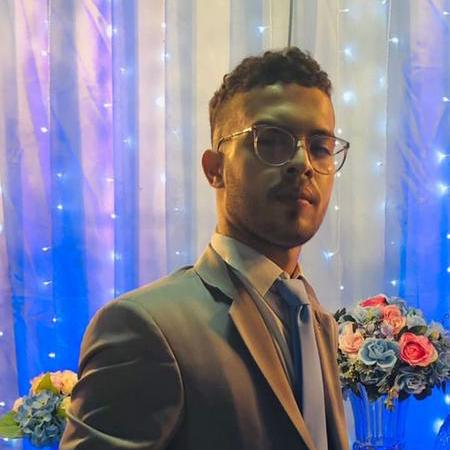

<h1 align="center"> Academia 1000 DEVS - Mesttra  </h1>

<h2> 📑 Hackathon - objetivo </h2>

A aplicação consiste no desenvolvimento de um algoritmo que seja capaz de buscar por vagas de desenvolvedores

   
<h2> Tecnologias utilizadas </h2>
 

  
  
  

<h2> 🎓 Equipe de Desenvolvimento </h2>

|Integrantes da Equipe|Linkedin|Github|Avatar|
|:---------|:-------:|:------:|:------:|
|<strong>Bruno Daniel</strong>|[Linkedin](https://www.linkedin.com/in/bdsoares/ ) | [Github](https://github.com/bdsoares)||
|<strong>Fábia Alves</strong>|[Linkedin](https://www.linkedin.com/in/f%C3%A1bia-alves-a98566146/) | [Github](https://github.com/fabiaalv3s)||
|<strong>Beatriz Carvalho</strong>|[Linkedin]( ) | [Github](https://github.com/BeatrizSouz)||
|<strong>Kamilla de Almeida</strong>|[Linkedin](https://www.linkedin.com/in/kamilla-de-almeida-e-silva-a3577223a/ ) | [Github](https://github.com/KamillaAS)||
|<strong>Alex dos Santos</strong>|[Linkedin](https://www.linkedin.com/in/alex-dos-santos-bomfim-ab5383231/ ) | [Github](https://github.com/Alex-SB7)||

